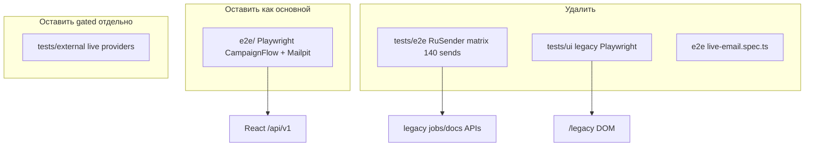

# Аудит проекта mailing-agent

**Дата:** 2026-07-18  
**Объём:** сборка/Docker, тестовые стеки, legacy UI, мёртвый код, docs/env, артефакты  
**Метод:** инвентаризация репозитория + перекрёстные ссылки (imports/scripts/compose). Построчный ревью каждой бизнес-функции генератора/парсера не входил в scope — фокус на том, что тормозит сборку/прогоны и на явно лишнем/неверном.

**Вердикты:** `удалить` | `сократить` | `исправить` | `оставить`  
**Приоритеты:** P0 (сразу) → P3 (после снятия blockers)

---

## 1. Executive summary

Проект тормозит не из‑за «тяжёлых unit‑тестов сами по себе», а из‑за **жирного Docker‑образа**, **всегда включённого тяжёлого compose‑стека** и **пересекающихся локальных «full»‑скриптов**, которые пересобирают образы и гоняют одни и те же suites по нескольку раз. Параллельно в репозитории живут **три независимых e2e‑мира**, из которых два устарели относительно React CampaignFlow.

### Топ‑10 проблем

| # | Проблема | Вердикт | Ожидаемый эффект |
|---|----------|---------|------------------|
| 1 | Python RuSender send matrix (`tests/e2e`, ~140 live‑отправки) | **удалить** (подтверждено владельцем как лишнее) | −30–60 мин (parallel) / −3–6 ч (sequential) при каждом полном прогоне |
| 2 | `scripts/e2e.ps1 full`: update snapshots + chromium ×2 + firefox/webkit | **сократить** | −1 полный chromium‑прогон и лишний snapshot‑update |
| 3 | `scripts/qa.ps1 full`: smoke ⊂ chromium, email/visual дубли, frontend build дважды | **сократить** | −десятки минут на «локальном CI» |
| 4 | App `Dockerfile`: fonts + Playwright Chromium + ML (`chromadb`, `sentence-transformers`) | **сократить** (split image / extras) | холодная сборка с 15–45+ мин → заметно меньше |
| 5 | Compose: 2× Gotenberg + OnlyOffice всегда | **сократить** (profile) | быстрее `up` для dev/e2e smoke |
| 6 | `--build` почти на каждом Playwright run (`e2e.ps1` / `e2e:test`) | **исправить** | минуты на каждый прогон тестов |
| 7 | `docker-compose.test.yml`: `uv sync` на каждый `run` | **сократить** | минуты на каждый unit‑прогон |
| 8 | Legacy UI + `tests/ui/*` + embed‑тесты `#s-statistics` | **удалить** (после снятия blockers) | −5–15 мин acceptance; разблокирует удаление ~0.8 MB static + 434 KB HTML |
| 9 | Untracked `artifacts/import-from-test/` (~731 MB) + `.tmp_cookies.txt` | **удалить** + gitignore | clone/disk; риск утечки cookies |
| 10 | README: `cp .env.e2e.example .env.docker` для matrix | **исправить** | ломает локальный UI‑стек (`mailing` vs `mailing_e2e`) |

### Рекомендуемые тестовые полосы (замена «full»)

| Полоса | Команда (целевая) | Когда |
|--------|-------------------|-------|
| **PR smoke** | frontend typecheck+vitest + `docker-compose.test.yml` + `npm run e2e:test:smoke` (chromium) | каждый день / перед PR |
| **Nightly** | chromium full + `@email` + `@visual` | ночь |
| **Manual gated** | `tests/external` (live providers) | по необходимости, с секретами |
| **Не гонять** | RuSender matrix, `e2e.ps1 full` idempotency, legacy `tests/ui` | — |

Cloud CI (`.github/workflows`) **отсутствует** — вся стоимость локальная.

---

## 2. Карта тестовых стеков



### 2.1 Docker Playwright — `e2e/` (основной UI e2e)

Конфиг: `e2e/playwright.config.ts`, образ `e2e/Dockerfile`, проект compose `mailing-agent-e2e`, DB `mailing_e2e`, Mailpit.

| Путь | Назначение | Вердикт | Примечание |
|------|------------|---------|------------|
| `e2e/tests/setup/auth.setup.ts` | health + Mailpit clean + cookie | **оставить** | зависимость всех projects |
| `e2e/tests/smoke/infrastructure.spec.ts` | `@smoke` health/login/home | **оставить** | |
| `e2e/tests/auth/auth.spec.ts` | login/logout/session | **оставить** | |
| `e2e/tests/navigation/navigation.spec.ts` | `@smoke` меню/404 | **оставить** | лёгкий overlap с infra |
| `e2e/tests/statistics/statistics.spec.ts` | `@smoke` React stats tabs | **оставить** | замена legacy stats UI |
| `e2e/tests/campaigns/campaign-flow.spec.ts` | draft + `@email` launch → Mailpit | **оставить** | главный CampaignFlow send path |
| `e2e/tests/email/smtp-mailpit.spec.ts` | `@email @smoke` SMTP test API | **оставить** | |
| `e2e/tests/email/attachments.spec.ts` | gen docs через `/api/jobs` + SMTP attachment | **сократить** | путь документов — legacy job API, не CampaignFlow materials; timeout до 900s |
| `e2e/tests/email/live-email.spec.ts` | placeholder, throws if enabled | **удалить** | мёртвый stub; live закрывает `tests/external` |
| `e2e/tests/visual/screens.spec.ts` | `@visual` CampaignFlow routes | **оставить** | |
| `e2e/tests/fixtures/ui.ts` → `goToScreen` | навигирует `/legacy` | **удалить** helper | callers в e2e нет |
| Orphan snapshots: `generator|sender|home-settings|parser-chromium-linux.png` | ~850 KB | **удалить** | текущий `screens.spec.ts` их не снимает |

Спеки **не** ходят на `/legacy` (кроме мёртвого helper). Это правильный стек для UI.

### 2.2 Python RuSender send matrix — `tests/e2e/` (лишнее)

Матрица из `tests/e2e/config.py` + `matrix.py`:

- 5 work types × 3 document modes × KP variants → ~35 generation jobs  
- × 2 send modes (`consent_request`, `materials`) × 2 recipient strategies → **~140 send runs**  
- транспорт только `rusender` (реальные письма)

| Путь | Вердикт |
|------|---------|
| `tests/e2e/run_send_matrix.py` | **удалить** |
| `tests/e2e/matrix.py`, `api_client.py`, `consent_helpers.py`, `job_reset.py`, `verify.py`, `report.py`, `config.py` | **удалить** |
| `tests/e2e/test_send_matrix_smoke.py` | **удалить** |
| `tests/e2e/README.md` | **удалить** (или заменить короткой пометкой «removed») |
| `tests/e2e/fixtures/*` | **сократить**: оставить только то, что нужно `attachments.spec.ts` / Mailpit (или перенести фикстуры в `e2e/fixtures` / `fixtures/`) |
| `scripts/run-e2e-matrix.ps1`, `run-e2e-matrix.sh`, `run-e2e-fast.ps1`, `monitor-e2e-progress.ps1` | **удалить** |
| README секция «E2E send matrix» + `cp .env.e2e → .env.docker` | **исправить/удалить** |

**Не путать** с Docker Playwright `@email` (Mailpit) — тот оставляем.

### 2.3 Legacy Python UI Playwright — `tests/ui/` (устарело)

Цели: `#s-statistics`, `window.goToScreen`, legacy SMTP DOM. При `USE_LEGACY_UI=0` и React на `/` suite **сломан или бессмысленен**.

| Путь | Вердикт |
|------|---------|
| `tests/ui/harness.py` | **удалить** |
| `tests/ui/test_statistics_ui.py` | **удалить** |
| `tests/ui/test_smtp_mailboxes_ui.py` | **удалить** |
| `tests/ui/test_scheduled_send_ui.py` | **удалить** |
| `tests/ui/test_auto_call_export_ui.py` | **удалить** |
| `tests/ui/fixtures_acceptance.py` | **удалить** |
| `scripts/run-acceptance-e2e.ps1` (UI half) | **удалить или переписать** на CampaignFlow/`e2e/` |

Покрытие уже есть в `e2e/tests/{statistics,navigation,campaigns,email/smtp-mailpit}`.

### 2.4 Live providers — `tests/external/` (оставить gated)

| Путь | Вердикт |
|------|---------|
| `tests/external/*` (`test_ext_send`, webhook, mailbox, bounce, recon) | **оставить** | gated (`EXT_STATS_ENABLED` и секреты); это не CampaignFlow UI и не устаревшая matrix job×send |

### 2.5 Unit/integration

- **~102** модуля `tests/test_*.py`, запуск: `docker compose -f docker-compose.test.yml run --rm test` → `python -m tests`
- Matrix (`tests/e2e`) **не** входит в `python -m tests` (отдельный runner) — хорошо, но скрипты/docs всё ещё соблазняют гонять часами

| Путь | Вердикт | Почему |
|------|---------|--------|
| `tests/test_statistics_embed_template.py` | **удалить или переписать** | asserts `#s-statistics` / `/public/statistics.js` в legacy `index.html` — lock‑in мёртвого UI |
| Остальные unit/integration без сигнала на removed feature | **оставить** | отдельный проход после удаления legacy |

### 2.6 Frontend unit

- `frontend/`: vitest + typecheck — **оставить**
- Vite scaffold `frontend/src/main.ts`, `counter.ts`, `style.css`, assets — **удалить** (entry = `main.tsx`)

---

## 3. Сборка и Docker

### 3.1 `Dockerfile` (app/worker = `mailing-agent:local`)

| Stage | Что делает | Проблема |
|-------|------------|----------|
| `frontend-build` | `npm install` → build | не `npm ci`; слабее cache/reproducibility |
| runtime | apt fonts/browser libs → `uv sync --frozen --no-dev` → **`playwright install chromium`** → pypdf/pymupdf → COPY | огромный образ; Chromium в app нужен в основном для Python `tests/ui`, не для React e2e |

Зависимости в default sync (`pyproject.toml`): `playwright`, `chromadb`, `sentence-transformers` — тянут образ даже когда RAG/UI‑browser не нужны.

**Рекомендации:**

1. Split: slim runtime (API/worker) vs optional image с Playwright для Python UI (который лучше удалить).
2. Вынести `chromadb` / `sentence-transformers` в extras / отдельный tag.
3. Frontend stage: `npm ci` + BuildKit cache mounts.
4. Node Playwright оставить только в `e2e/Dockerfile` (уже так).

### 3.2 Compose

| Файл | Роль | DB |
|------|------|-----|
| `docker-compose.yml` | base: app, worker, postgres, minio, redis, **2× gotenberg**, **onlyoffice** | `mailing` / `pgdata` |
| `docker-compose.dev.yml` | local UI + Mailpit; `SEED_DEMO_DATA_ON_STARTUP=0`; `USE_LEGACY_UI=0` | same |
| `docker-compose.test.yml` | unit/integration | `mailing_test` / `pgdata-test` |
| `docker-compose.e2e.yml` | Playwright overlay + Mailpit; seed=1 | `mailing_e2e` |

**Лишнее для большинства прогонов:** второй Gotenberg + OnlyOffice (health start_period 120s). Вынести OnlyOffice (и при возможности 2‑й Gotenberg) в compose profile.

### 3.3 `docker-compose.test.yml`

```yaml
command: uv sync --frozen --extra dev --extra mcp --no-install-project && .venv/bin/python -m tests
```

Каждый `run` заново sync’ает extras. **Сократить:** test image target с уже установленными `dev`+`mcp`, либо cache volume для `.venv`.

### 3.4 `.dockerignore`

Исключает `artifacts`, `e2e`, `design-input`, dumps — хорошо для app build context. E2E собирается отдельно из `./e2e`.

---

## 4. Скрипты QA / E2E

### 4.1 `scripts/qa.ps1 full` (локальный «CI gate»)

Порядок сегодня:

1. frontend typecheck  
2. frontend vitest  
3. backend docker tests  
4. alembic на **dev** стеке (нужен поднятый app)  
5. playwright **smoke**  
6. playwright **chromium full** (smoke ⊂ этого)  
7. firefox smoke  
8. webkit smoke  
9. `@email`  
10. `@visual`  
11. frontend **production build** снова  

**Проблемы:** дубли smoke/chromium/email; frontend build после уже прогнанных тестов; alembic зависит от dev stack; нет path‑filters.

**Целевой slim `full` / лучше три полосы (§1).**

### 4.2 `scripts/e2e.ps1`

- `Cmd-Test` всегда: `run --rm --build playwright`  
- `full`: clean/up → **update visual snapshots** → chromium → firefox-smoke → webkit-smoke → **chromium снова** (idempotency)

**Исправить:** `--build` только в `build`/`up`; убрать default snapshot‑update и второй chromium (флагами при необходимости).

Корневой `package.json`: `e2e:test` тоже с `--build`; `e2e:test:chromium` — без `--build` (несогласованность).

### 4.3 `scripts/dev.ps1`

| Поведение | Вердикт |
|-----------|---------|
| всегда `--build` на start | **сократить**: флаг SkipBuild / rebuild только при frontend changes |
| после start всегда `seed_demo_data(force=False)` | **исправить**: конфликтует с `SEED_DEMO_DATA_ON_STARTUP=0` и правилом про imported test‑stand stats |
| печатает `Legacy UI: …/legacy` | **исправить**: не рекламировать deprecated path |

### 4.4 Matrix / acceptance runners

| Скрипт | Вердикт |
|--------|---------|
| `run-e2e-matrix.ps1`, `run-e2e-fast.ps1`, `monitor-e2e-progress.ps1`, `run-e2e-matrix.sh` | **удалить** вместе с `tests/e2e` |
| `run-acceptance-e2e.ps1` | **удалить UI half** / переписать на `e2e/` |
| `refresh-app.ps1` (grep legacy `index.html` SMTP markers) | **исправить/удалить** |

---

## 5. Legacy UI и API‑дубли

### 5.1 Legacy surface (ещё жива)

| Путь | Размер / роль | Вердикт |
|------|---------------|---------|
| `templates/index.html` | ~434 KB | **удалить** после снятия blockers |
| `src/web/static/documents_ui.js` | ~10 KB | **удалить** с legacy |
| `src/web/static/sender_ui.js` | ~20 KB | **удалить** |
| `src/web/static/preview_ui.js` | ~20 KB | **удалить** (проверить нужен ли docxjs vendor иначе) |
| `src/web/static/statistics.js` + css | ~88 KB JS | **удалить** |
| `src/web/static/chart.min.js` | ~201 KB | **удалить** с legacy stats |
| `main.py` `/legacy`, `USE_LEGACY_UI`, spa fallback | wiring | **удалить** route / flag после миграции |
| `templates/login.html`, `register.html` | legacy auth HTML | **удалить** когда SPA всегда есть |
| `src/web/public_router.py` `/public/*-ui.js`, stats, chart | **сократить** | оставить health, mail-signature, нужный vendor |

Compose уже `USE_LEGACY_UI=0`, React на `/`, но `/legacy` **всегда доступен** и удерживается тестами/docs.

### 5.2 Blockers удаления legacy

1. `tests/test_statistics_embed_template.py`  
2. `tests/ui/*`  
3. `e2e/.../ui.ts` `goToScreen`  
4. docs/scripts, рекламирующие `/legacy`  
5. возможное использование legacy job APIs в `attachments.spec.ts` и worker‑пайплайне (API можно оставить дольше UI)

### 5.3 API поверхности

| Surface | Вердикт | Кто использует |
|---------|---------|----------------|
| `/api/v1/*` | **оставить** | React, MCP |
| `/api/sender/manager-dashboard`, campaigns stats, … | **оставить** | React statistics, MCP |
| `/api/smtp/setup/*`, oauth | **оставить** | React connections |
| `/api/smtp/mailboxes*` | **сократить/deprecate** | не React; e2e `appApi`, unit/legacy UI tests; React идёт через `/api/v1/connections` |
| `/api/documents/*` | **оставить** (shared) | React campaigns + worker + старые тесты |
| `/api/generate`, `/api/generator/*`, `/api/sender/run|chat`, `/api/parser/*` | **оставить backend**; не расширять UI‑клиенты | worker/pipeline; matrix (к удалению) |
| Dual chains: `/api/v1/chains/*` vs campaign email-chain | **оставить** short-term | React использует оба; рефактор отдельно |

---

## 6. Мёртвый код и артефакты

### 6.1 Frontend

| Путь | Вердикт | Evidence |
|------|---------|----------|
| `frontend/src/main.ts`, `counter.ts`, `style.css`, Vite assets | **удалить** | scaffold; entry = `main.tsx` |
| `frontend/src/components/ActiveSendingCard.tsx` | **подключить или удалить** | **ноль imports**; visual masks `[data-testid="active-sending-card"]`; docs утверждают наличие |
| Orphan visual PNGs (generator/sender/home-settings/parser) | **удалить** | ~850 KB; не в текущем `screens.spec.ts` |

### 6.2 Python (точечно)

| Путь | Вердикт |
|------|---------|
| `src/parser_new/test_email.py` (содержимое diag_rayon) | **исправить имя / удалить** misnamed diagnostic |
| `src/generator/knowledge/ingest_philology_source.py` | **оставить** | CLI tool |
| `src/campaigns/seed.py` | **оставить** | startup/e2e/dev.ps1 |

Крупного «мёртвого пакета» Python не найдено: `parser`/`parser_new`, `bitrix_board` ещё referenced.

### 6.3 Bulk / tmp

| Путь | Размер | Вердикт |
|------|--------|---------|
| `artifacts/import-from-test/job_states.tar.gz` | **~725 MB** (untracked) | **удалить с диска**; gitignore `artifacts/import-from-test/` |
| dumps рядом (`agent_states`, `job_docs`, `job_stats`) | ~6 MB | **удалить** / gitignore |
| `.tmp_cookies.txt` | untracked | **удалить**; gitignore `.tmp_*` |
| `src/parser_new/output/**/*.xlsx` | tracked вопреки `.gitignore` | **untrack + не коммитить** |
| `design-input/**` (~4.7 MB) + дубль `opisanie-…(1).md` | design only | **сократить** (вынести из repo) |
| `service_docs/*.xlsx` | крупные samples | **оставить или LFS** — не блокер скорости тестов |

`.gitignore` уже имеет `src/parser_new/output/`, но **нет** явного правила на `artifacts/import-from-test/` / `.tmp_cookies.txt`.

---

## 7. Docs / env — неверное и конфликтующее

| Путь | Проблема | Вердикт |
|------|----------|---------|
| `README.md` «E2E send matrix» + `cp .env.e2e.example .env.docker` | путает e2e env с local `.env.docker`; ломает правило local vs e2e DB | **исправить** (убрать matrix; не копировать e2e→docker) |
| `README.md` `templates/index.html` = «веб‑интерфейс» | React — default UI | **исправить** |
| `tests/e2e/README.md` тот же `cp .env.e2e → .env.docker` | то же | **удалить** с matrix |
| `docker-compose.dev.yml` vs `dev.ps1 start` seed | header/compose seed=0, скрипт всегда сидит | **исправить** скрипт или документировать явно |
| `scripts/dev.ps1` Legacy URL | реклама `/legacy` | **исправить** |
| `docs/opisanie-tekushchego-ui.md` + `design-input/opisanie-…(1).md` | описывают legacy wizard как текущий | **архивировать / obsolete stamp** |
| `STATISTICS_AUDIT.md` (если ещё утверждает отсутствие Mailpit / legacy stats frontend) | устарел | **исправить или stamp obsolete** |
| `docs/implementation/FINAL_RESULT.md` Active Sending card | компонент не смонтирован | **исправить** |
| `.env.e2e.example` | корректный для Playwright | **оставить**; убрать/почистить комментарии про `RUN_REAL_E2E` matrix после удаления |
| `.env.docker.example` | нужен для base stack | **оставить**; уточнить что vault key нужен и для `/api/v1/connections` |

Workspace rules уже верные (`no-legacy-ui`, `local-vs-test-containers`) — **docs/scripts отстают от rules**.

---

## 8. Матрица решений (path → вердикт → приоритет → эффект)

### P0 — диск / безопасность / путаница env

| Path | Вердикт | Эффект |
|------|---------|--------|
| `artifacts/import-from-test/*` (~731 MB) | удалить + gitignore | disk/clone |
| `.tmp_cookies.txt` | удалить + gitignore | secrets risk |
| README / e2e README `cp .env.e2e → .env.docker` | исправить | защита local `mailing` |

### P1 — время прогонов (тесты)

| Path | Вердикт | Эффект |
|------|---------|--------|
| `tests/e2e/**` (matrix) + matrix scripts | удалить | −часы live send |
| `tests/ui/**` + acceptance UI | удалить | −5–15 мин; unlock legacy |
| `tests/test_statistics_embed_template.py` | удалить/retarget | unlock legacy |
| `e2e/.../live-email.spec.ts` | удалить | dead code |
| `e2e/.../ui.ts` `goToScreen` | удалить | cleanup |
| orphan visual snapshots | удалить | −~850 KB |
| `scripts/e2e.ps1` full / `--build` | сократить | −повторные chromium/build |
| `scripts/qa.ps1` full | сократить до smoke+unit+frontend | −десятки минут |
| `e2e/.../attachments.spec.ts` | сократить до sample PDF SMTP | −до ~15 мин worst‑case |

### P2 — время сборки / `up`

| Path | Вердикт | Эффект |
|------|---------|--------|
| `Dockerfile` Playwright+fonts+ML | сократить / split | холодная сборка |
| frontend `npm install` → `npm ci` | исправить | cache/repro |
| OnlyOffice / 2× Gotenberg | profile | быстрее up |
| `docker-compose.test.yml` uv sync every run | test image layer | быстрее unit |
| `dev.ps1` always build+seed | исправить | быстрее local iter |

### P3 — удаление legacy UI surface

| Path | Вердикт | Эффект |
|------|---------|--------|
| `templates/index.html` + static JS/CSS/chart | удалить | −~0.8 MB + confusion |
| `main.py` `/legacy`, `USE_LEGACY_UI` | удалить | один UI path |
| `public_router` legacy assets | сократить | |
| login/register HTML templates | удалить если SPA‑only | |
| `/api/smtp/mailboxes` clients | deprecate → v1 connections | API hygiene |

### Оставить (важно не вырезать)

| Path | Почему |
|------|--------|
| `e2e/tests/{smoke,auth,navigation,statistics,campaigns,email/smtp-mailpit,visual}` | основной CampaignFlow e2e |
| `tests/external/**` (gated) | live provider risk |
| `docker-compose.test.yml` + ~102 unit modules | regression backend |
| frontend vitest/typecheck | SPA |
| `/api/v1`, documents API, statistics APIs used by React | продукт |

---

## 9. Roadmap cleanup (без реализации в этом аудите)

### Фаза 0 — гигиена диска (часа)

1. Удалить локально `artifacts/import-from-test/` и `.tmp_cookies.txt`.  
2. Добавить в `.gitignore`: `artifacts/import-from-test/`, `.tmp_*`, `.tmp_cookies.txt`.  
3. Untrack `src/parser_new/output/**` если ещё в git.

### Фаза 1 — вырезать лишние e2e (1–2 дня)

1. Удалить `tests/e2e` matrix + scripts + README секции.  
2. Перенести нужные фикстуры для Mailpit attachments (если ещё нужны) в `e2e/` или `fixtures/`.  
3. Удалить `tests/ui`, `live-email.spec.ts`, orphan snapshots, dead `goToScreen`.  
4. Удалить/retarget `test_statistics_embed_template.py`.  
5. Упростить `qa.ps1` / `e2e.ps1` (полосы из §1; без double chromium; без default `--build` на test).

### Фаза 2 — ускорить Docker (2–4 дня)

1. `npm ci` в frontend-build; cache mounts.  
2. Убрать Playwright Chromium из app image после удаления `tests/ui`.  
3. ML deps → extras / отдельный image.  
4. OnlyOffice (+ опционально 2‑й Gotenberg) за profile.  
5. Test image с preinstalled `dev`+`mcp`.

### Фаза 3 — снести legacy UI (после фазы 1)

1. Убрать `/legacy`, static wizard JS/CSS, USE_LEGACY_UI.  
2. Почистить `public_router`, docs, `dev.ps1`.  
3. Решить судьбу `ActiveSendingCard` (wire в StatisticsPage или delete + убрать masks).

### Фаза 4 — опциональный CI

Добавить `.github/workflows/`:

- job **lint/unit**: frontend + `docker-compose.test.yml`  
- job **e2e-smoke**: chromium `@smoke` only  
- **не** класть matrix / `e2e.ps1 full` / multi‑browser на каждый PR  

---

## 10. Оценки времени (порядок величины)

| Активность сейчас | Оценка |
|-------------------|--------|
| Холодная сборка app image | 15–45+ мин |
| Тёплый rebuild только frontend stage | несколько минут |
| `docker-compose.test.yml run` | минуты–десятки (с uv sync) |
| Playwright chromium suite | ~3–15+ мин (attachments раздувают) |
| `qa.ps1 full` / `e2e.ps1 full` | **1–3+ часа** |
| RuSender matrix | **30–60 мин** parallel / **3–6 ч** sequential |

| После фаз 0–2 (целевое) | Оценка |
|-------------------------|--------|
| PR smoke (unit + e2e smoke) | ориентир **15–40 мин** warm |
| Nightly chromium+email+visual | ориентир **30–90 мин** |
| Matrix | **0** (удалена) |

---

## 11. Инвентарь e2e файлов (полный checklist)

### Docker Playwright specs (9)

- [x] keep — `setup/auth.setup.ts`  
- [x] keep — `smoke/infrastructure.spec.ts`  
- [x] keep — `auth/auth.spec.ts`  
- [x] keep — `navigation/navigation.spec.ts`  
- [x] keep — `statistics/statistics.spec.ts`  
- [x] keep — `campaigns/campaign-flow.spec.ts`  
- [x] keep — `email/smtp-mailpit.spec.ts`  
- [ ] shrink — `email/attachments.spec.ts`  
- [ ] delete — `email/live-email.spec.ts`  
- [x] keep — `visual/screens.spec.ts`  

### Python `tests/e2e` — delete suite

- [ ] delete — весь пакет кроме решения по fixtures для attachments  

### Python `tests/ui` — delete suite

- [ ] delete — все 4 test_* + harness + fixtures_acceptance  

### Scripts

- [ ] delete — matrix runners  
- [ ] shrink — `qa.ps1`, `e2e.ps1`  
- [ ] fix — `dev.ps1` seed + Legacy URL  
- [ ] fix/delete — `run-acceptance-e2e.ps1`, `refresh-app.ps1`  

---

## 12. Заключение

Главный рычаг ускорения — **перестать гонять и поддерживать три e2e‑мира** и **урезать full‑скрипты/образ**, а не микрооптимизировать unit‑тесты. По указанию владельца **RuSender send matrix (`tests/e2e`, ~140 вариантов отправки) считается лишней** и должна быть удалена первой среди тестового долга. Параллельно нужно снять blockers с legacy UI (`tests/ui`, embed‑тест статистики) и выровнять docs/scripts с уже принятыми workspace rules (React‑only manual path, раздельные DB для local/e2e/test).

Этот файл — единственный deliverable аудита; изменения кода/скриптов в рамках аудита не выполнялись.
