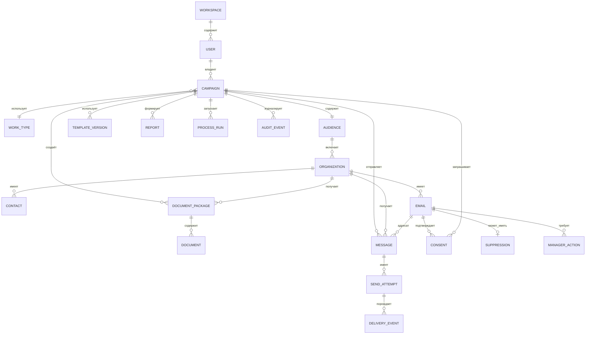

# Сущности и информационная архитектура Mailing Agent

Дата ревизии: 15 июля 2026 года.

Этот документ описывает продуктовые сущности, которые должны быть отражены в UX и макетах. Технические таблицы и внутренние процессы включены отдельно, чтобы не превращать интерфейс в копию базы данных.

## 1. Что представляет собой продукт

Mailing Agent — сервис подготовки персонализированных документов и их рассылки по организациям. Текущий основной сценарий:

1. Настроить рассылку и загрузить шаблоны.
2. Загрузить или собрать таблицу организаций.
3. Сформировать и проверить документы.
4. Проверить письма и подтвердить отправку.
5. Отследить доставку, согласия, проблемы и дальнейшие действия.

Главная продуктовая сущность — **рассылка**. В коде она называется `job`, а в статистике — кампанией. Сейчас это фактически один и тот же объект: одна рассылка соответствует одному `job_id`.

## 2. Человеческие роли

| Роль | Что делает | Текущее состояние |
| --- | --- | --- |
| Оператор | Создаёт рассылку, загружает данные и шаблоны, запускает документы и отправку | Реализована ролью `user` |
| Администратор | Видит все рассылки, создаёт пользователей, управляет стоп-листом и защитой отправки | Реализована ролью `admin` |
| Менеджер | Анализирует интерес, назначает звонок, повторную отправку или ручную проверку | Есть как сценарий статистики, но отдельной auth-роли нет |
| Получатель | Получает письмо, подтверждает согласие и получает материалы | Публичный сценарий без входа в сервис |

Системные участники: парсер, генератор документов, филолог, отправщик, фоновые worker-процессы и почтовые провайдеры.

## 3. Канонические продуктовые сущности

### 3.1 Рабочая область

Граница данных команды или организации.

Основные поля: `tenant_id`, название, участники, политики доступа.

Связи: содержит пользователей и рассылки.

### 3.2 Пользователь

Человек, работающий в сервисе.

Основные поля: username, роль, рабочая область, дата создания.

Связи: владеет рассылками, создаёт действия менеджера и отчёты.

### 3.3 Рассылка

Главный контейнер пользовательской работы. Технический идентификатор — `job_id`.

Основные поля:

- название;
- владелец и рабочая область;
- вид работ;
- режим документов: КП, договор или оба;
- тема письма и отправитель;
- провайдер отправки;
- сценарий: запрос согласия или немедленная отправка материалов;
- стратегия адресов: все адреса или основной с резервным;
- текущий этап, статус, прогресс и даты.

Связи: содержит аудиторию, шаблоны, документы, отправки, согласия, отчёты и события.

Рекомендуемый жизненный цикл:

`Черновик → Данные готовы → Документы готовятся → Документы готовы → Проверка отправки → Ожидает подтверждения → Отправляется → Завершена`

Ответвления: `Остановлена`, `Ошибка`.

### 3.4 Вид работ

Справочник продукта или услуги, для которой формируются материалы.

Текущие значения:

- МНГП поселений;
- МНГП муниципальных районов;
- СТП МО;
- случайный лес;
- описание границ территориальных зон.

Определяет тексты, тему письма, названия файлов и формулировки согласия.

### 3.5 Шаблон

Исходник для персонализированного контента.

Типы:

- текст письма;
- коммерческое предложение;
- договор.

Основные поля: тип, имя файла, формат, контрольная сумма, найденные переменные, предупреждения, дата загрузки.

### 3.6 Версия шаблона

Неизменяемая версия адаптивного шаблона КП.

Основные поля: `template_id`, формат, адаптер, поля, возможности, результат сертификации, признак активной и последней версии.

Состояния сертификации: `pending`, `passed`, `failed`. Только прошедшая проверку версия может стать активной.

### 3.7 Аудитория / таблица данных

Набор организаций конкретной рассылки. Источником служит загруженный Excel или результат парсинга.

Основные поля: источник, имя файла, число строк, ошибки проверки, дата обновления, статус готовности.

Рекомендуемые состояния: `Нет данных`, `Загружается`, `Собирается`, `Проверяется`, `Готова`, `Есть ошибки`.

### 3.8 Организация-получатель

Одна строка таблицы. Сейчас в интерфейсе одновременно называется клиентом, компанией, муниципальным образованием и администрацией.

Каноническое имя для интерфейса: **организация**. Для профильных сценариев допустима подпись вида «Организация / муниципальное образование».

Основные поля:

- ID строки;
- субъект РФ;
- муниципальный район;
- муниципальное образование;
- полное название администрации;
- адрес;
- руководитель;
- численность населения;
- ИНН, КПП, ОГРН, ОКПО, ОКТМО;
- примечание;
- агрегированный статус и уровень интереса.

Связи: имеет контакты и адреса, получает документы и участвует в рассылках.

### 3.9 Контакт

Человек или роль внутри организации. В текущей таблице явно хранится руководитель, а остальные контакты представлены только адресами и телефонами.

Основные поля: ФИО, должность или роль, телефоны, связь с организацией.

### 3.10 Email-адрес

Самостоятельная сущность, потому что статусы доставки, согласие и стоп-лист относятся к конкретному адресу, а не ко всей организации.

Основные поля: адрес, роль (`основной` или `дополнительный/резервный`), валидность, домен, провайдер, признак подавления.

Связи: принадлежит организации или контакту; имеет письма, события доставки, согласия и действия менеджера.

### 3.11 Запуск сбора данных

Попытка собрать аудиторию через парсер.

Основные поля: запрос, что ищем, география, объём, требуемые поля, использованные инструменты и источники, число найденных записей, длительность, статус и ошибки.

### 3.12 Пакет документов

Комплект материалов для одной организации в одной рассылке.

Содержит коммерческое предложение, договор, PDF-версии и связанные результаты проверки. Режим пакета: `КП`, `Договор`, `КП + договор`.

### 3.13 Документ

Отдельный созданный файл.

Основные поля: тип, формат, организация, версия шаблона, путь или объект хранилища, дата создания, результат проверки, обнаруженные и исправленные проблемы.

Рекомендуемые состояния: `Ожидает`, `Формируется`, `Проверяется`, `Готов`, `Требует внимания`, `Ошибка`.

### 3.14 Запуск обработки

Фоновый процесс над рассылкой: сбор данных, генерация, проверка текста, подготовка или отправка писем.

Общие состояния: `idle`, `queued`, `running`, `completed`, `stopped`, `error`; для документов также встречается `waiting_review`.

В интерфейсе это процесс с этапами, прогрессом, текущим объектом, журналом и возможностью остановить или продолжить.

### 3.15 Письмо

Конкретное сообщение на конкретный email в рамках рассылки.

Основные поля: организация, email, тема, текст, набор вложений, сценарий отправки, провайдер, дата, результат.

Важное правило модели: одна организация может породить несколько писем, если используется основной и дополнительный адрес.

### 3.16 Попытка отправки

Техническая попытка передать письмо провайдеру. Нужна для повторов, fallback-сценария и объяснения ошибок.

Основные поля: письмо, номер попытки, провайдер, внешний `message_id`, время, HTTP/провайдерский ответ, ошибка.

### 3.17 Событие доставки

Событие от почтового провайдера: письмо принято, доставлено, открыто, ссылка нажата, адрес не существует, жалоба и так далее.

Канонические пользовательские статусы:

- доставлено;
- открыто;
- переход по ссылке;
- email не работает;
- временная ошибка;
- ошибка доставки;
- отписка;
- жалоба / спам;
- ожидает статуса;
- нет данных от сервиса.

Статус организации сейчас вычисляется как лучший статус среди её адресов. В деталях обязательно нужно сохранять статусы каждого email отдельно.

### 3.18 Согласие

Согласие конкретного email получить конкретный набор материалов.

Основные поля: токен, организация, email, режим вложений, текст согласия, срок действия, статус, даты запроса и подтверждения, технические данные подтверждения.

Состояния: `pending`, `request_sent`, `confirmed`, `expired`.

У согласия есть отдельное состояние выдачи материалов: `queued`, `sent`, `error`.

### 3.19 Стоп-лист

Запрет отправки на email.

Основные поля: email, причина, источник, связанная рассылка, дата создания и дата окончания. Управление доступно администратору.

### 3.20 Защита отправки

Глобальная пауза рассылок при превышении порога жалоб или ошибок API.

Основные поля: активность паузы, причина, время паузы и метрики. Возобновление доступно администратору.

### 3.21 Действие менеджера

Следующий ручной шаг по организации или email.

Типы: перезвонить, повторить отправку, найти другой email, создать задачу, проверить вручную, не трогать.

Основные поля: ответственный, срок, комментарий, приоритет, автор и дата.

### 3.22 Отчёт

Сформированная выгрузка по рассылкам.

Типы: сводка доставки, журнал отправок, согласия, проблемные адреса.

Форматы: XLSX, CSV, NDJSON. Основные поля: период, автор, статус, дата, параметры и файл.

### 3.23 Журнал / событие процесса

Хронологическая запись действий и результатов парсера, генератора, филолога, отправщика, согласий и менеджеров. Пользовательская форма — журнал на соответствующем экране; техническая форма — поток событий с порядковым номером.

## 4. Технические поддерживающие сущности

Эти сущности важны для архитектуры, но не должны становиться основными разделами интерфейса:

- сессия авторизации;
- состояние агента;
- фоновая задача и worker;
- правило парсера;
- ошибка парсера;
- статистика источника парсера;
- счётчик потока событий;
- файл в объектном хранилище;
- чат с агентом и его память.

## 5. Главные связи

## 6. Текущие экраны и объекты на них

| Экран | Главные сущности |
| --- | --- |
| Настройки | Рассылка, вид работ, режим документов, шаблоны, отправитель |
| Таблица / парсинг | Аудитория, организация, запуск сбора данных, журнал |
| Документы | Запуск обработки, пакет документов, документ, отчёт исправлений |
| Отправка | Письмо, email, провайдер, стратегия адресов, попытка отправки |
| Старая статистика | Рассылка, агрегированные счётчики, история `job` |
| Новая статистика | Рассылка, организация, email, доставка, согласие, действие менеджера, отчёт |
| Публичное подтверждение | Согласие и выдача материалов |

Модальные сценарии: параметры парсинга, AI-проверка шаблона, предпросмотр документа или файла, расширенные фильтры, экспорт отчёта, действие менеджера, карточка организации и сводка рассылки.

## 7. Проблемы терминологии и структуры

### Критические

1. **`job`, кампания и рассылка обозначают один объект.** Пользовательское имя должно быть одно: «Рассылка». `job_id` следует скрыть как технический идентификатор.
2. **Клиент, компания, МО и администрация смешаны.** Базовую сущность лучше назвать «Организация», а профильное название показывать вторым уровнем.
3. **Email нельзя считать просто полем организации.** Доставка, согласие, fallback и стоп-лист живут на уровне конкретного адреса.
4. **В интерфейсе одновременно есть старая и новая статистика.** Это создаёт два конкурирующих финальных шага. В целевой архитектуре должна остаться новая статистика.

### Важные

5. Шаги начинаются с нуля, хотя пользовательский процесс состоит из пяти обычных шагов.
6. Список всех рассылок спрятан внутри старой статистики; отдельного стартового экрана с черновиками и историей нет.
7. Документы показаны в основном агрегатами и архивом; отсутствует удобная таблица пакетов по организациям с индивидуальными ошибками.
8. Действия менеджера существуют, но роль менеджера не определена в модели доступа.
9. Глобальные админские объекты — стоп-лист, защита отправки и пользователи — имеют API, но не оформлены как цельный административный раздел.
10. Настройки рассылки разделены между первым экраном и экраном отправки. Это допустимо, но в сводке рассылки должны быть видны все выбранные параметры.

## 8. Предлагаемая информационная архитектура

### Верхний уровень

1. **Рассылки** — список, черновики, активные и завершённые.
2. **Организации** — единая база и карточки организаций.
3. **Аналитика** — обзор, доставки, согласия, проблемы, отчёты.
4. **Шаблоны** — библиотека и версии шаблонов.
5. **Администрирование** — пользователи, стоп-лист, защита отправки, провайдеры.

### Рабочее пространство одной рассылки

1. Обзор.
2. Аудитория.
3. Документы.
4. Отправка.
5. Результаты.

Это сохраняет текущий пошаговый сценарий, но помещает его внутрь явно выбранной рассылки.

## 9. Структура файла Figma

Рекомендуемые страницы:

1. `00 Foundations` — цвета, типографика, сетка, статусы.
2. `01 Entities & IA` — карта сущностей, роли и навигация.
3. `02 Campaigns` — список и создание рассылок.
4. `03 Campaign Workspace` — обзор, аудитория, документы, отправка, результаты.
5. `04 Organizations` — список, карточка, контакты, адреса и история.
6. `05 Analytics` — обзор, рассылки, согласия, проблемы и отчёты.
7. `06 Templates` — библиотека, версии, сертификация и предпросмотр.
8. `07 Admin` — пользователи, стоп-лист и защита отправки.
9. `08 Public Consent` — публичные состояния согласия.
10. `09 Components` — таблицы, фильтры, статусы, прогресс, загрузка, модальные окна.
11. `10 Edge Cases` — пустые состояния, ошибки, остановка, повтор, истёкшее согласие.

## 10. Следующий шаг дизайна

Перед детальными макетами нужно зафиксировать три решения:

1. Используем ли везде слово «Организация» или профильное «Муниципальное образование».
2. Считается ли одна рассылка неизменяемым запуском или её можно повторно запускать как несколько отдельных запусков.
3. Кто будет пользоваться блоком действий менеджера: оператор, отдельный менеджер или администратор.

После этого можно строить карту экранов и low-fidelity wireframes без риска закрепить противоречивую модель.
