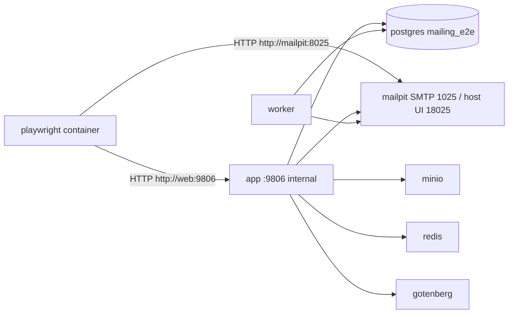

# Playwright in Docker — mailing-agent

## Scope vs local manual testing

| Mode | How to start | Compose project | DB | Host UI |
|------|--------------|-----------------|----|---------|
| Local manual / UI | `.\scripts\dev.ps1 start` | `mailing-agent` (directory default) | `mailing` | http://localhost:9806 |
| Playwright E2E | `.\scripts\e2e.ps1 …` / `npm run e2e:*` | **`mailing-agent-e2e`** | `mailing_e2e` | http://localhost:19806 (see `.env.e2e`) |
| Unit/integration | `docker compose -p mailing-agent-test -f docker-compose.test.yml run --rm test` | project `mailing-agent-test` | `mailing_test` | n/a |

E2E must **not** rewrite the local `app` on `:9806`. Scripts pass `-p mailing-agent-e2e` and use non-conflicting host ports (`APP_PUBLIC_PORT=19806`, `MAILPIT_UI_PORT=18025`).

## Architecture



Playwright browsers run **only** inside `mcr.microsoft.com/playwright:v1.61.1-noble`.
Do not install Playwright browsers on the Windows host.

Inside the Playwright container, `localhost` is the Playwright container itself.
Always use service DNS names (`http://web:9806`, `http://mailpit:8025`).

**Why not `http://app:9806`?** Chromium treats the bare hostname `app` like the public `.app` TLD and forces HTTPS, which breaks plain HTTP to the FastAPI container. The e2e overlay adds a Docker network alias `web` for Playwright.

## Requirements

- Docker Desktop with Compose v2
- Existing `.env.docker` (from `.env.docker.example`)
- `.env.e2e` (auto-created from `.env.e2e.example` by `scripts/e2e.ps1`)

## First run

```powershell
cp .env.e2e.example .env.e2e   # if missing
.\scripts\e2e.ps1 full
```

Or:

```powershell
npm run e2e:full
```

## Everyday commands

```powershell
.\scripts\e2e.ps1 build
.\scripts\e2e.ps1 up
.\scripts\e2e.ps1 test
.\scripts\e2e.ps1 smoke
.\scripts\e2e.ps1 email
.\scripts\e2e.ps1 visual
.\scripts\e2e.ps1 update-snapshots
.\scripts\e2e.ps1 report
.\scripts\e2e.ps1 down
.\scripts\e2e.ps1 clean
```

npm equivalents: `npm run e2e:test`, `e2e:test:chromium`, `e2e:test:smoke`, …

### Single test / browser

```powershell
.\scripts\e2e.ps1 test -- --project=chromium tests/email/smtp-mailpit.spec.ts
```

### Headed debug (Xvfb inside container)

```powershell
.\scripts\e2e.ps1 headed
.\scripts\e2e.ps1 debug
```

## Artifacts

| Path | Content |
|------|---------|
| `artifacts/playwright/report/index.html` | HTML report (open in browser; no host Playwright needed) |
| `artifacts/playwright/results/` | failures, junit |
| `artifacts/playwright/traces/` | traces on failure |
| `artifacts/playwright/videos/` | videos on failure |
| `e2e/tests/**/*-snapshots/` | visual baselines (committed; generate only in Docker) |

## Mailpit

- UI (host, e2e project): http://localhost:18025 (from `MAILPIT_UI_PORT` in `.env.e2e`)
- API (Docker): http://mailpit:8025
- SMTP (Docker): mailpit:1025
- Local manual stack still uses http://localhost:8025 via `dev.ps1`

## Test DB rules

- Compose project **`mailing-agent-e2e`** isolates volumes from local `dev.ps1` (`mailing` / `pgdata`).
- E2E overlay sets `DATABASE_URL` → database **`mailing_e2e`**.
- Production database `mailing` is not used by the Playwright overlay.
- App startup runs Alembic migrations into `mailing_e2e`.
- Do not point E2E at a production database URL.
- After E2E, `.\scripts\e2e.ps1 down` (or `npm run e2e:down`). Local UI stays on `.\scripts\dev.ps1 start`.

## Secrets

- Never commit `.env.e2e`, `.env.e2e.local`, or real SMTP/API keys.
- Live provider tests require `RUN_LIVE_EMAIL_TESTS=1` and `LIVE_SMTP_*` secrets; they are skipped by default.
- Standard suite uses Mailpit only (`SMTP_ALLOW_REAL_SEND=1` toward Mailpit, not external providers).

## Adding a test

1. Add a spec under `e2e/tests/<area>/`.
2. Tag with `@smoke` / `@email` / `@visual` as appropriate.
3. Reuse `tests/fixtures/mailpit.ts`, `appApi.ts`, `consoleGuard.ts`.
4. Run via Docker: `.\scripts\e2e.ps1 test -- tests/area/foo.spec.ts`.

## Diagnostics

| Symptom | Check |
|---------|--------|
| `connect ECONNREFUSED 127.0.0.1` | Wrong baseURL — use `http://app:9806` |
| App unhealthy | `docker compose … logs app`, open `/health` |
| SMTP auth errors | Mailpit must have `MP_SMTP_AUTH_ACCEPT_ANY=true`; mailbox host=`mailpit`, port=`1025`, ssl/starttls off |
| Empty Mailpit | Confirm `SMTP_ALLOW_REAL_SEND=1` in e2e overlay; clear via API DELETE `/api/v1/messages` |
| Visual mismatch | Update only via `.\scripts\e2e.ps1 update-snapshots` inside Docker (Linux), never from Windows host |
| Missing lockfile | Rebuild playwright image; `package-lock.json` must exist in `e2e/` |
